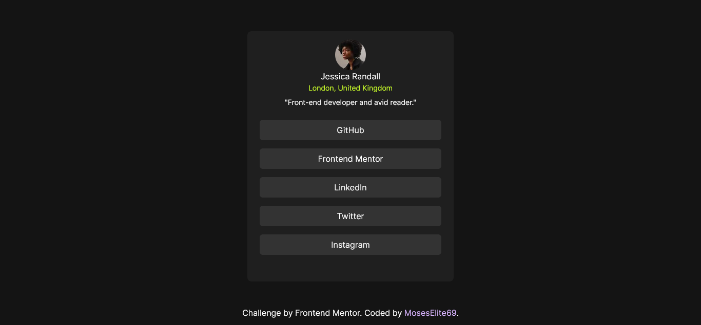

# Frontend Mentor - Social links profile solution

This is a solution to the [Social links profile challenge on Frontend Mentor](https://www.frontendmentor.io/challenges/social-links-profile-UG32l9m6dQ). Frontend Mentor challenges help you improve your coding skills by building realistic projects. 

## Table of contents

- [Overview](#overview)
  - [The challenge](#the-challenge)
  - [Screenshot](#screenshot)
  - [Links](#links)
- [My process](#my-process)
  - [Built with](#built-with)
- [Author](#author)

**Note: Delete this note and update the table of contents based on what sections you keep.**

## Overview

### The challenge

Users should be able to:

- See hover and focus states for all interactive elements on the page

### Screenshot

### Links

- Solution URL: [Solution URL here](https://github.com/MosesElite69/social-links-profile-next)
- Live Site URL: [Live site URL here](https://github.com/MosesElite69/social-links-profile-next)

## My process

### Built with

- Semantic HTML5 markup
- CSS custom properties
- Flexbox
- CSS Grid
- Mobile-first workflow
- [React](https://reactjs.org/) - JS library
- [Next.js](https://nextjs.org/) - React framework

## Author

- Website - [social-links-profile-next](https://social-links-profile-next.netlify.app)
- Frontend Mentor - [MosesElite69](https://www.frontendmentor.io/profile/MosesElite69)
- Twitter - [RealMosesElite](https://twitter.com/RealMosesElite)
- Instagram - [moses_elite2020](https://www.instagram.com/moses_elite2020)
- Facebook - [elliot.moses](https://www.facebook.com/elliot.moses.568)
- LinkedIn - [elliot-moses](https://www.linkedin.com/in/elliot-moses-17a444296/)
